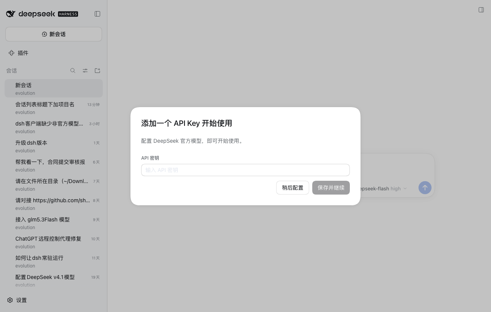
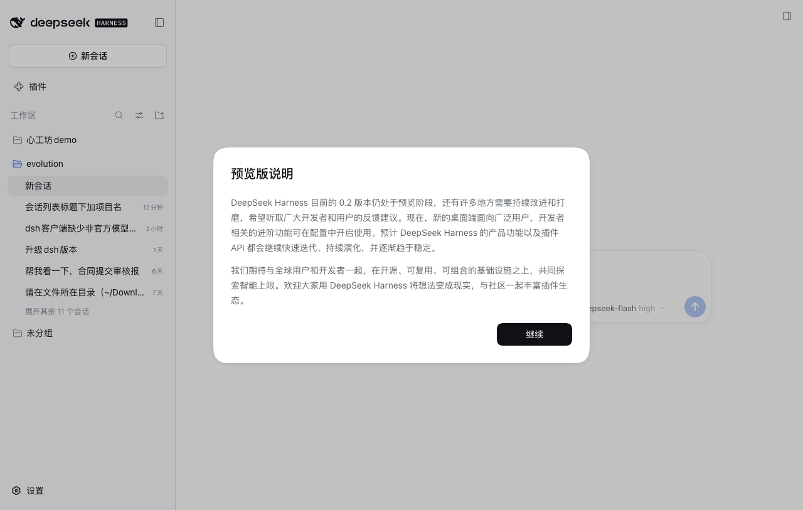

# dsh-plugin-session-project

在 DSH 侧边栏的**单列表**会话视图（视图选项 → 分组方式 → **单列表**）里，把每个会话所属的
**项目（工作区）名称**显示在会话标题下方。



分组视图（按工作区 / 按工作区树）不变——项目名已经由分组标题给出：



## 安装

本包同时是一个 **DSH bundle**（自带补丁层）和一个 **client plugin**（`dsh.client`），
安装后插件页面/插件清单里可以看到并开关它。仓库：<https://github.com/Schrei5/dsh-plugin-session-project>

```bash
# 1) 装进 profile（git 地址 / 本地目录 / tarball 都行）
dsh plugin --profile desktop add github:Schrei5/dsh-plugin-session-project
# 或：dsh plugin --profile desktop add /path/to/dsh-plugin-session-project

# 2) 选用这个 bundle（Web 插件页面里打开开关，或改 profile 的 dsh.profile.bundles）
```

也可以完全不装包，直接在 profile 的补丁层里手写一行指向本包入口：

```yaml
# ~/.dsh/profiles/<profile>/cordis.patch.yml
- insert:
    - id: session-project-label
      name: /absolute/path/to/dsh-plugin-session-project/lib/index.js
```

两种方式二选一，不要同时用（会产生两个同 id 的行）。配置改动由 `dsh-hmr`（默认开启）热应用，
无需重启应用。最低 DSH 版本：`0.2.0-rc.2`。

## 行为

- 只在**单列表**视图生效。判断方式：侧边栏里存在工作区分组行时不生成任何样式。
- 名称取该会话所属工作区的标题；仍是首次使用的自动标题（`default-workspace`）时，
  显示本地化的「默认工作区 / Default workspace」。
- 不属于任何工作区的会话显示「未分组 / Ungrouped」。
- 已归档会话的项目名与标题一样使用更淡的 caption 颜色。
- 搜索结果的会话行不受影响（没有项目名，行高不变）。

## 实现

| 文件 | 作用 |
|---|---|
| `lib/index.js` | 宿主半：无行为，只为让 Loader 挂载本行、让 `dsh-client-modules` 从同一份 manifest 读到 `dsh.client` |
| `lib/client.js` | 浏览器半：生成样式表并订阅会话/工作区/语言变化 |
| `cordis.patch.yml` | bundle 补丁层：插入 `session-project-label` 这一行 |

浏览器半**不修改 React 树、不插入节点**，只写入一张按需生成的样式表：
以 `data-row-key="session:<id>"` 定位会话行，用 `::after { content: … }` 生成项目名。
行高从 32px 变为 48px（`box-sizing:border-box` + `padding-bottom:16px`，内容盒仍是 32px，
标题 / 状态点 / 时间 / 悬停操作按钮位置照旧），项目名画在下面那 16px 里。
名称来源：客户端服务 `workspaces.list`（工作区标题与 `sessionIds`）与 `sessions.list`（会话顺序）。

## 兼容性注意

实现依赖 `@deepseek-ai/dsh-client-ui-workspace` 当前的会话行结构
（`data-row-key="session:<id>"`、32px 单行 flex 布局、`.title`/`.time` 子元素顺序）。
该结构变化时样式需同步调整；届时插件本身不会报错，只是标签位置或行高会走样。

## 关闭 / 移除

- 暂停：插件页面里关掉这个 bundle；或给补丁行加 `disabled: true`。
- 移除：`dsh plugin --profile <profile> remove dsh-plugin-session-project`，
  并把它从 `dsh.profile.bundles` 里去掉；手写补丁方式则删掉那段 `- insert:`。

## 维护（发布新版本）

本目录就是仓库工作副本（`git init` 过，origin 指向 GitHub）：

```bash
cd ~/.dsh/plugins/dsh-plugin-session-project
# 改完 lib/ 或 package.json 后：记得 bump version
git commit -am "feat: ..."
git push
```

- 其他设备更新：`dsh plugin --profile <profile> add github:Schrei5/dsh-plugin-session-project`（重装即取最新），
  或在插件页面重新安装。
- 本机的 profile 用的是 `link:` 指向本目录，改完 `lib/client.js` 后主机需要在重载/重启后重新快照客户端产物；
  稳妥做法是重启一次 DSH。
- 未发布到 npm（本仓库主推 GitHub 安装；社区插件市场按 GitHub 仓库收录，本仓库符合其“package.json 声明了可启用 DSH bundle”的口径）。

## License

MIT © 2026 Schrei5
